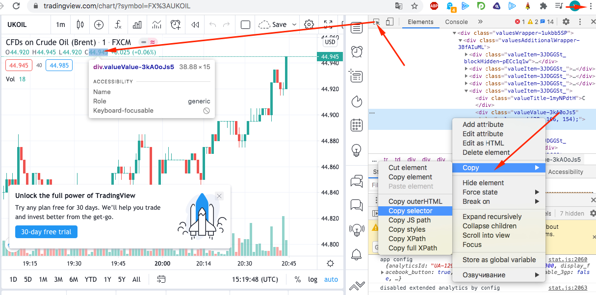

# Node.js + pupeeter TradingView price scrapper
Getting current price of UKOIL ticker

How full graph is looks:

Hereis result of script running:

Here what variable we are scrap:

How to find and copy selectors:

